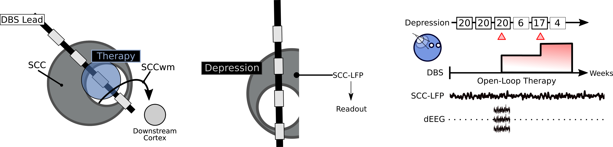
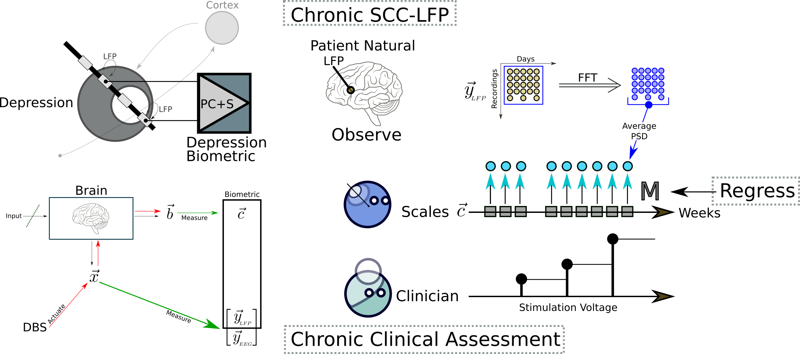

# SCC Readouts
A major aim of my PhD.
This repo has all the code for the oscillatory decoder of depression state from SCC-LFP

The overview [notebook](Notebooks/DR_Overview.ipynb) is the best starting point.

## Decoding Depression
The brain gives rise to behaviors, and when those behaviors go wrong we can get things like depression.
There's got to be some signal measurable in the brain that can tell us how bad the depression is.

In this project, my goal was to use patient recordings captured over months of therapy to decode the severity of their depression, or their *depression state*.

